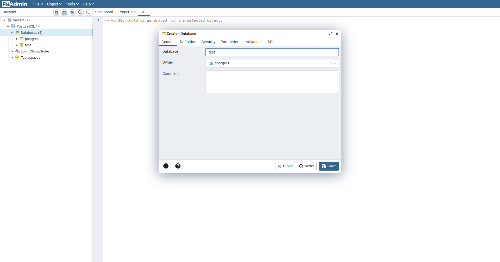
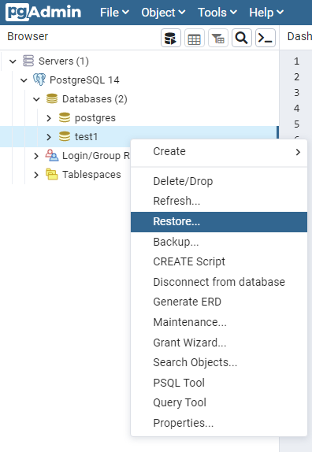
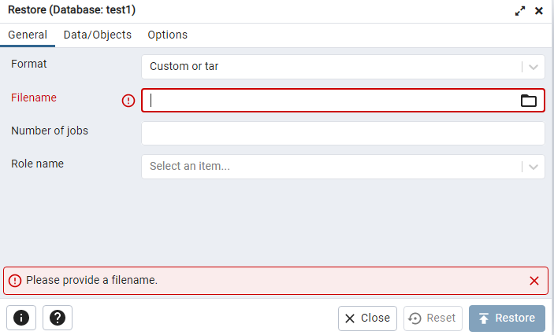

# Run the assigment API
The following steps describes how to run the API:

##Prerequisites
1. Download and install PostgreSQL on your system: https://www.postgresql.org/download/
2. Preferably IntelliJ IDEA (https://www.jetbrains.com/idea/), but any other IDE that supports Java and Maven will suffice.
3. Run PostgreSQL and create a new database called "test1":

4. Build tables "Orders", "Payments", and "Products" as follows:

5. Select the "accenture001.sql" file in the root path:

6. Now you can access the API of "Amount paid per user" by 